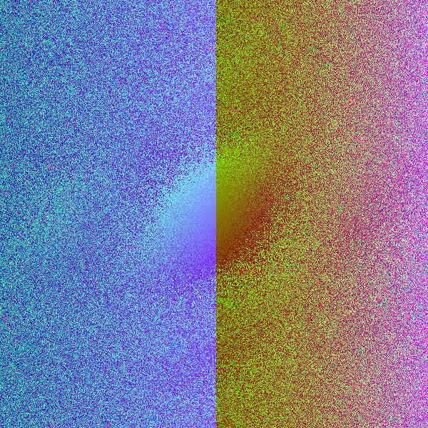
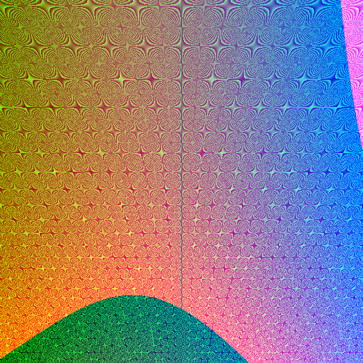

# randomart

A simple program to generate images using [the RandomArt algorithm](http://users.ece.cmu.edu/~adrian/projects/validation/validation.pdf).

## Examples

Although grammar used to generate expressions still needs a bit of tweaking and I haven't implemented
the probabilities for different rule branches, I've managed to get a few cool looking images.




## Installation

The program can be installed by running this command:

```bash
$ go install github.com/waterfountain1996/randomart/cmd/randomart@latest
```

## Usage

```
Usage of randomart:
	$ randomart -out x.png -depth 9 -width 400 -height 400
	Generate a 400x400 image at x.png with a expression tree depth of 9

	$ randomart -seed foobar -out x.png
	Generate an image with the given seed. Only the first 32 bytes of the seed string are used.

Advanced options:
	-depth int
	      Expression tree depth (default 8)

	-out string
	      Image output file (default "randomart.png")

	-seed string
	      Seed for the random number generator

	-width int
	      Image width (default 600)

	-height int
	      Image height (default 600)
```
